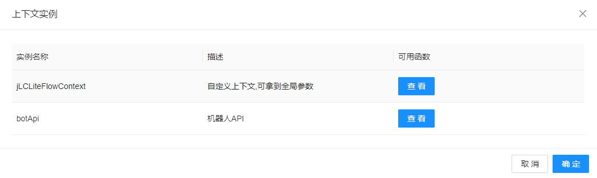

# JLC-BOT

#### 介绍

* java语言实现的机器人框架，提取自dnf-admin的机器人功能独立迭代
* 使用门槛低、不需要精通某种语言、只需要有最基本的编程经验和网络相关知识
* 低代码拖拽开发,类工作流网页配置但要比工作流更简单.
* 加入liteflow,节点执行性能强、扩展性高、支持的节点语言丰富
* 实现了antvx的节点数据格式转liteflow节点数据
* 支持节点执行详细的全链路在线网页调试、方便高级开发
* 支持沙盒测试
* 支持调用ollama模型聊天
* **支持多语言开发高级功能**(java groovy python lua aviator)
* 简单指令开发支持
* 高级开发支持
* webhooks支持
* 可直接查看系统可用api

* gitee https://gitee.com/yuzhanfeng/JLC-BOT
* github https://github.com/easy-do/JLC-BOT

#### 使用技术

- 后端 spring-boot , sa-token , mybatis-flex , liteflow 
- 前端 antd-pro 、antvx6
- 协议端 自行发掘
- 数据库: 默认使用H2DB、当前支持mysql和H2DB (其他数据库是否支持请查阅mybatis-flex官方文档)
- 使用OneBotV11协议的数据格式进行对接适配、理论上所有v11协议的bot客户端可直接对接


#### 相关链接
- sa-token: https://sa-token.cc/
- mybatis-flex: https://mybatis-flex.com/
- liteflow: https://liteflow.cc/
- antd-pro: https://pro.ant.design/docs/getting-started/
- antvx6: https://x6.antv.antgroup.com/tutorial/getting-started
- OneBot-V11标准: https://github.com/botuniverse/onebot-11
- ollama: https://github.com/ollama/ollama


#### 支持功能

- 对接方式: httpPost 、正向websocket、反向websocket、 wcf-hook(windows)、wcf-http上报
- 兼容平台 centos、windows、docker (wx只能windows)
- 已支持全部上报事件处理
- 低代码能力

#### 文档&更新日志

https://doc.easydo.plus


#### 快速开始

##### docker命令一键启动

``` shell
  docker run -dit --name jlc-bot -p 8888:8888 -v /data/jlc-bot:/data registry.cn-hangzhou.aliyuncs.com/gebilaoyu/jlc-bot:1.0.1
```
* 访问地址: http://服务器或主机ip:8888
* 接口文档: http://服务器或主机ip:8888/doc.html
* 数据库文件存放地址: /data/jlc-bot/db
* 账号密码：123456789/12345678

##### docker编排

下载docker-compose.yaml后一键启动编排 

* 访问地址: http://服务器或主机ip:8888 
* 接口文档：http://服务器或主机ip:8888/doc.html
* 数据库文件存放地址: /data/db
* 账号密码：123456789/12345678

##### windows安装使用

* https://www.123pan.com/s/DUoAjv-aBDRA.html 提取码: i4lJ
* 下载文件解压缩到本地磁盘、双击启动.bat 
* 访问地址：http://localhost:8888
* 接口文档：http://localhost:8888/doc.html
* 数据库文件存放地址: 解压目录/data/db
* 账号密码：123456789/12345678

##### 上报地址说明

* 标准http上报 : http://ip:8888/api/oneBot/v11/post (密钥在机器人页面点击编辑按钮查看和修改)
* 反向websocket: ws://ip:8888/ws/oneBot (密钥在机器人页面点击编辑按钮查看和修改)
* 正向websocket: 机器人管理-> 添加机器人 -> 通信地址 填入协议端的websocket地址 (密钥在机器人页面点击编辑按钮查看和修改)
* wcf rust客户端 http上报: http://ip:8888/api/oneBot/wcfPost?token=xxxx (密钥在机器人页面点击编辑按钮查看和修改)

#### 低代码功能示例

* 示例demo 包含 控制群授权、随机美图、随机视频、查询天气、拓展节点等
* https://www.123pan.com/s/DUoAjv-aBDRA.html 提取码: i4lJ  下载示例配置.7z 解压后再页面导入配置

#### 页面截图展示

* 节点配置


* 在线调试


* 调试结果


* 模拟沙盒测试


* 模型聊天


* 高级调试





#### 使用问题反馈和技术交流

http://qm.qq.com/cgi-bin/qm/qr?_wv=1027&k=jKliJIxAFvZoZxBSw1NnlMjOj8pRR42f&authKey=vnozKSs2ou1MO68VXH1ct2AReURSyIj4jlVe%2BVAlA5h%2F0M1BsdhQP0YN6MqwRwBB&noverify=0&group_code=154213998


